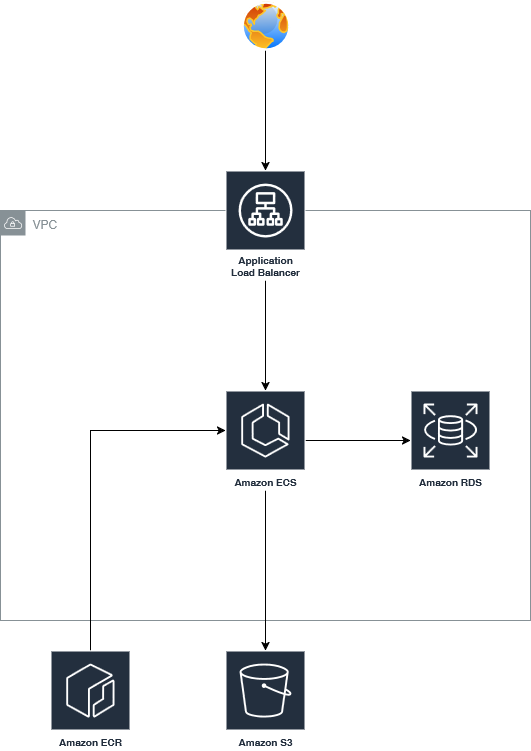

# Vehicle Catalog

A Spring Boot REST API to manage a catalog of vehicles and their images.
This guide will get you up and running with it!

## Tables of contents
- [Getting Started](#getting-started)
  - [Prerequisites](#prerequisites) 
  - [Using the deployed API](#using-the-deployed-api)
    - [Endpoints](#endpoints)
  - [App Deployment](#app-deployment)
  - [Infra Deployment](#infrastructure-deployment)
- [Architecture](#architecture)
  - [Code](#code)
  - [Infra](#infra)
- [Hidden Stuff!](#hidden-stuff)

## Getting Started
### Prerequisites
While we don't need anything more than "curl" and a .jpg hanging about to use the API, we'll some tools
for the infrastructure deployment:

- Terraform
- Terragrunt
- aws-cli (optional)

### Using the deployed API
The API only has two paths: `/vehicles` and `/images` with basic CRUD operations, pretty easy to use.
If you want to test only the `vehicle` endpoint, go ahead to the next section. But if you want to test
the `/images` path, make sure to download some vehicle image(I'd suggest a Passat), we'll upload it to a S3 Bucket.

### Endpoints
#### VEHICLES
get vehicles
```bash
curl -X GET http://vehicle-catalog:8080/vehicles
```

get vehicle
```bash
curl -X GET http://vehicle-catalog:8080/vehicles/{id}
```

create new vehicle
```bash
curl -X POST \
-H "Content-Type: application/json" \
-d '{
  "name": "Polo GTI",
  "brand": "Volkswagen",
  "model": "Highline",
  "horsepower": "90",
  "makeYear": "2026",
  "trunkCapacity": "300",
  "transmission": "AUTOMATIC",
  "drivetrain": "FWD",
  "price": "90000.00",
  "images": []
}' \
http://vehicle-catalog:8080/vehicles
```

update vehicle
```bash
curl -X PUT \
-H "Content-Type: application/json" \
-d '{
  "name": "Polo GTI",
  "brand": "Volkswagen",
  "model": "Highline",
  "horsepower": "90",
  "makeYear": "2026",
  "trunkCapacity": "300",
  "transmission": "AUTOMATIC",
  "drivetrain": "FWD",
  "price": "90000.00",
  "images": []
}' \
http://vehicle-catalog:8080/vehicles/{id}
```

delete vehicle
```bash
curl -X DELETE \
vehicle-catalog:8080/vehicles/{id}
```

### IMAGES
get all images
```bash
curl -X GET \
vehicle-catalog:8080/images
```

get image by id
```bash
curl -X GET \
vehicle-catalog:8080/images/{imageId}
```

create image
```bash
curl -X POST \
-F 'file=@/path-to-my/image.jpg' \
vehicle-catalog:8080/vehicles/{vehicleId}/images
```

update image
```bash
curl -X PUT \
-F 'file=@/path-to-my/image.jpg' \
vehicle-catalog:8080/images/{imageId}
```

delete image
```bash
curl -X DELETE \
vehicle-catalog:8080/images/{imageId}
```


### App Deployment
GitHub Actions is being in charge of building and deploying the image.
The pipeline is automatically triggered for deployment when there's a new commit in the main branch.
To deploy the app to the cloud, that's all there is to it.

### Infrastructure Deployment
First configure you aws credentials, use the aws-cli if possible, simply run `aws configure` and
follow the instructions. Of course, create your Access Keys first.

Also install terraform and terragrunt. Terragrunt is a wrapper with a few QoL features for Terraform, we're
using it to auto-generate our backend bucket so we don't need to deal with that.

To start, simply run `terragrunt init` so terraform can generate its required files.
Now, we're going to set up the database environment variable: TF_VAR_db_password
This will become the db password, so don't set it in the repo or anywhere else! It's just an environment variable.

Now run `terragrunt apply`, read the changes and type "yes" to apply the infra!

In about 10 minutes the entire infrastructure will be set up.

Also, Terraform will return a few variables, store them somewhere to use later.

But we have a couple of manual adjustments to make.

Go to the Systems Manager service on AWS, and look for the Parameter Store, now edit all the parameters.
Examples of values for these parameters are in the `docker-compose.yml` and `application.properties` files.

Now you can trigger manually the pipeline on GitHub, and it'll deploy the app to ECS!

## Architecture

### Code
The overall concept of the architecture is simple:
The user is able to create, read, update and delete vehicles from the catalog.
All the changes are stored in a relational database.
Except for images, they're stored on S3 and are served through Cloudfront.
A reference to the Cloudfront link is then stored on the database and returned to the users.
The application itself is stateless and able to run multiple copies if necessary.

### Infra
The infrastructure is almost entirely handled by Terraform, the only exceptions being the
password for the db that is set manually during deploy, the other secrets in parameter store
and the task-definition.json file for GitHub Actions.
The main components of the infra are:
- Application Load Balancer - Being used to handle outside traffic into the cluster
- ECS - Using Fargate to keep it serverless and chosen due to its ease of maintenance and autoscaling setup
- RDS - Select Postgres and the database
- S3 - Used for images and storing the terraform state
- Cloudfront - Serves images to clients 
- ECR - Storing the container images
- Route53 - Being used to generate certificates for the domain, for TLS
